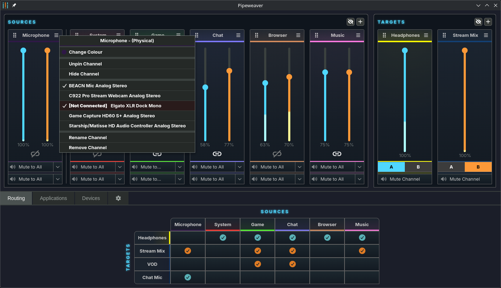

# Pipeweaver

**Pipeweaver** is an audio management tool for Linux built on top of [PipeWire](https://pipewire.org), designed
specifically with streaming and broadcasting in mind. Join us on [Discord](https://discord.gg/gKVREmSwTh).

****

### This project is still in heavy development.

Pipeweaver is in active development, and my not yet be usable for everyone on a daily basis. There are definitely
still some issues, and a lack of configuration for tuning that may make life a little difficult! It should, however
be stable enough to check out and play with.

Also note, that until I'm doing 'formal' releases changes to code may reset your settings. You have been warned!
****

Pipeweaver is an attempt to bring a simple way to manage complex streaming audio setups, it allows creation of virtual
audio sources, attaching physical audio sources, managing volumes (including matrix mixing), 'complex' mute
arrangements, and finally routing to physical and virtual outputs.

This readme is a work in progress, so details are a little on the slim side at the moment!

Configuration is done via a simple Web Page in your
browser ([reasoning here](https://github.com/pipeweaver/pipeweaver/wiki/Why-a-Web-Page%3F)) to allow you to access the
UI from wherever you may need it. An API is also available, allowing other devices to communicate and control audio.



****

# Getting Started

**NOTE**: We highly recommend Pipewire 1.4.0 and above, during development we encountered some strange latency issues,
especially when UCM devices were in the routing tree, these seem to have been solved in 1.4.0.

## Installation

### Automatic Installation
Pipeweaver provides a simple script which will attempt to install the correct package for your
distribution. This script will install the utility in such a way that future releases will be managed through your
standard package manager.

There is a [wiki page](https://github.com/pipeweaver/pipeweaver/wiki/Release-Transparency) which describes the
process, and how you can verify that the code you're running is the same as what is in this repository.

Run the following in a Terminal, and follow the prompts:
```bash
curl -fsSL https://pipeweaver.github.io/pipeweaver-repo/scripts/install.sh | bash
```

### Manual Installation
If you don't want to use the script, there are still options available! The [releases page](https://github.com/pipeweaver/pipeweaver/releases/latest) 
contains the following:

* `.rpm` package for Redhat based distributions (Fedora, CentOS, RHEL, etc)
* `.deb` package for Debian based distributions (Debian, Ubuntu, Linux Mint, Pop, etc)
* `.flatpakref` A reference file for the Beacn Utility Flatpak repository
* Compile from Source (instructions below)

### Notes
 * Pipeweaver is also available in the AUR as `pipeweaver`
 * The RPM and DEB packages do not provide automatic updates, and there's no app check.
 * For Bazzite, you can install the rpm via ostree, although I'd recommend the flatpak instead.

## Building

There are currently no builds available, so you'll have to do it yourself for now. The instructions are pretty simple.

Firstly, ensure you have rust (and cargo) installed, as well as pipewire.

#### Building the Pipeweaver Base

1) Check out the repository
2) Run `cargo build --release`
3) Grab the `pipeweaver-daemon` and `pipeweaver-client` binaries from `target/release/`
4) Run `pipeweaver-daemon` (probably in a terminal, but you can also manually configure it to autostart).
5) Pipeweaver will then create a 'Default' layout, with some nodes pre-routed
6) The configuration UI will be available at http://localhost:14565

#### Building Pipeweaver with the App

Pipeweaver provides a 'wrapper' app for the UI based on Qt to provide a more integrated desktop experience. This is
optional, and requires a few extra dependencies, but it is recommended for a better experience.

Firstly, install the dependencies for the app depending on your distribution:

Debian Based:

```
sudo apt-get install qt6-webengine-dev
```

Fedora Base:

```
sudo dnf install qt6-qtwebengine-devel
```

Arch Based:

```
sudo pacman -S qt6-webengine
```

Then perform the following:

1) Check out the repository
2) Run `cargo build --workspace --release`
3) Grab the `pipeweaver-daemon`, `pipeweaver-client`, and `pipeweaver-app` binaries from `target/release/`
4) Run `pipeweaver-daemon` (probably in a terminal, but you can also manually configure it to autostart).
5) Pipeweaver will then create a 'Default' layout, with some nodes pre-routed
6) The app will automatically launch for configuration

When you shut down pipeweaver, all the nodes and routes will be automatically removed.

****

## Current Status

Implemented:

* Virtual Channel Creation
* Physical Device Mapping
* Volumes, Muting, Routing
* Configuration Saving and Recall
* Tray Icon and .desktop Files
* Custom Channel Colours
* Command Line configuration tool
* Application Management (Move Applications to channels inside the UI)

Planned:

* A 'Tablet Mode' interface
* Multiple Profile Support
* Latency Tuning
* Useful Documentation

Possible Future Plans:

* LV2 support for Mic Effects (Gate, Compressor, Expander, Eq etc)
* flatpak support
